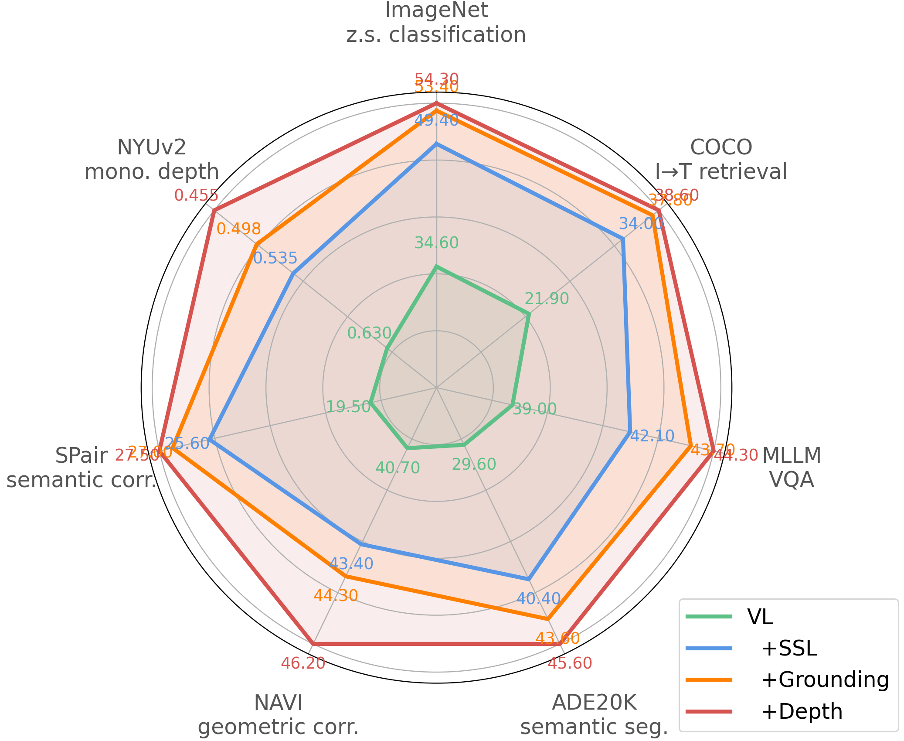
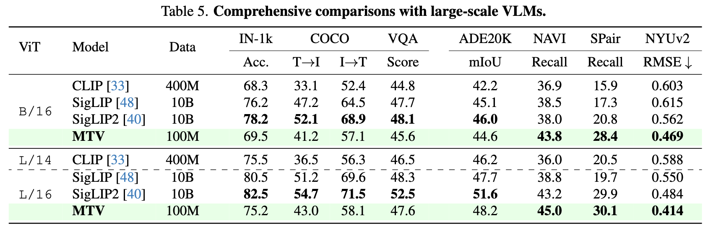

# Revisiting Multi-Task Visual Representation Learning

[*Shangzhe Di*](https://dszdsz.cn/), [*Zhonghua Zhai*](), [*Weidi Xie*](https://weidixie.github.io/)

Official implementation of **MTV**, a multi-task visual pretraining framework designed to bridge the gap between global semantic understanding and fine-grained spatial reasoning.

[](https://arxiv.org/abs/2601.13886)
[](https://huggingface.co/collections/Becomebright/mtv)

## 💡 Overview

MTV jointly optimizes a shared encoder across vision-language contrastive, self-supervised, and dense spatial objectives, by leveraging expert models to synthesize structured pseudo-labels at scale.





## 🔥 News

**[Jan 2026]** Pretrained models are now available on Hugging Face!

## 🤗 Model Zoo


[[MTV-base-patch16-224]](https://huggingface.co/Becomebright/MTV-base-patch16-224) | [[MTV-large-patch16-256]](https://huggingface.co/Becomebright/MTV-large-patch16-256)

## 🚀 Quick Start

Our models are built on the SigLIP architecture and are compatible with the `transformers` library.

```python
import requests
import torch
from PIL import Image
from transformers import SiglipModel, SiglipProcessor


model = SiglipModel.from_pretrained("Becomebright/MTV-base-patch16-224")
processor = SiglipProcessor.from_pretrained("Becomebright/MTV-base-patch16-224")

url = "http://images.cocodataset.org/val2017/000000039769.jpg"
image = Image.open(requests.get(url, stream=True).raw)

texts = ["a photo of 2 cats", "a photo of 2 dogs"]
inputs = processor(text=texts, images=image, padding="max_length", return_tensors="pt")

with torch.no_grad():
    outputs = model(**inputs)

logits_per_image = outputs.logits_per_image
probs = torch.softmax(logits_per_image, dim=1)
print(f"{probs[0][0]:.1%} that image 0 is '{texts[0]}'")
```

## 📅 Readmap

- [x] Model
- [x] Paper
- [ ] Training Code
- [ ] Evaluation Code

## 📝 Citation

If you find this work useful, please consider citing:
```
@article{di2026mtv,
  title={Revisiting Multi-Task Visual Representation Learning},
  author={Di, Shangzhe and Zhai, Zhonghua and Xie, Weidi},
  journal={arXiv preprint arXiv:2601.13886},
  year={2026}
}
```
